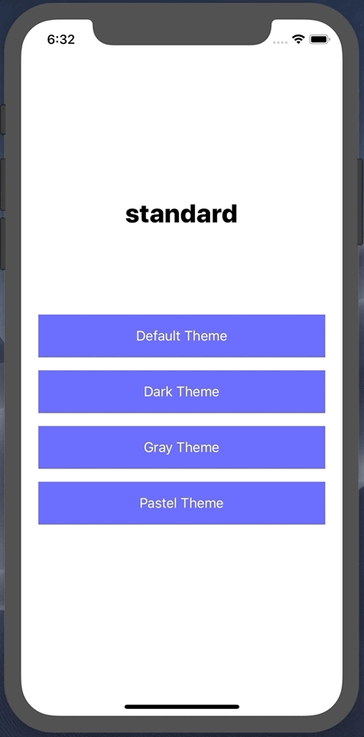

# simple-theme

A lightweight and flexible theming package for your React Native applications. Theme updates are applied without restarting your app. For flexibility-sake, theming structure is left entirely up to you. Simple-Theme simply tracks your active theme and provides a means to update said active theme from anywhere at any given time.




## Installation

```
npm install simple-theme
``` 
or 
```
yarn add simple-theme
```


# Docs

[`<SimpleTheme />` Component API](docs/SimpleTheme.md)<br/>
[`theme` API](docs/theme.md)


# Structuring Your Themes

Simple-Theme accepts your theming structure as is, and returns only the active theme object for your use within styles. **Each theme object must have a `name` *string* and `styles` *object* property** [see example](docs/exampleThemes.md). This provides flexibility for each unique use-case. Be forewarned, simple-theme expects all provided objects to have identical shapes. At this time, SimpleTheme provides no means of protecting against an undefined style properties. In an effort to provide such flexibility, if and how this protection is implemented is entirely up to the developer. While it's encouraged you use a structure fitting for your needs, provided [here](docs/exampleThemes.md) is an example of one possible approach.


# Setup & Usage

## SimpleTheme

```js
import { SimpleTheme } from 'simple-theme'
```

### App.js

```jsx
import React from 'react'
import AppMain from './AppMain'
import SimpleTheme from 'react-native-simple-theme'
import {
  darkTheme,
  grayTheme,
  pastelTheme,
  standardTheme,
} from './themes'

export const App = () => {
  return (
    <SimpleTheme
      additionalThemes={[darkTheme, grayTheme, pastelTheme]}
      defaultTheme={standardTheme}>
      <AppMain />
    </SimpleTheme>
  );
};
```

Wrap your app root with the `<SimpleTheme />` component. SimpleTheme handles the app's initial themes setup, as well as refreshing of your app with theme updates. Provide your default theme object and any additional theme objects for any other themes you will be offering.


## Consuming The Theme

### Button.styles.js

```js 
import theme from 'simple-theme'
```

```jsx
import theme from 'simple-theme'

const themedStyles = () => ({
  button: {
    alignItems: 'center',
    backgroundColor: theme.active.colors.background.button,
    borderRadius: theme.active.borders.button,
    height: 50,
    justifyContent: 'center',
    marginBottom: 15,
    width: '100%',
  },
  text: {
    color: theme.active.colors.text.button,
    fontSize: theme.active.fontSizes.button,
    fontStyle: theme.active.fontStyles.button,
    fontWeight: theme.active.fontWeights.button,
  },
});
```

The active style object is accessible via the `active` property of SimpleTheme's theme object. Styles will need to be written as a function.
Unlike Context, the style properties are imported directly into your style file. This keep your components clean as your components don't have to be aware of your theme, and aside from an update to the current active theme, will never trigger a re-render.

### Button.js

```jsx
import React from 'react';
import {Text, TouchableOpacity, View} from 'react-native';


export const Button = ({onPress, title}) => {
  const styles = themedStyles();

  return (
      <TouchableOpacity onPress={onPress} style={styles.button}>
        <Text style={styles.text}>{title}</Text>
      </TouchableOpacity>
  );
};
```

Because styles will have to be updated via a theme change, `const styles = themedStyles()` or whatever you have decided to name your style function will need to be defined within either your functional component or your classes `render()` method.


## Toggling/Updating The Active Theme

To change the active theme, call theme's `setActiveTheme()` method with the name of the theme being set.

```js
import React from 'react'
import { View } from 'react-native'
import { theme } from 'react-native-simple-theme'
import { THEME_NAMES } from './models'
import { Button } from './Button'

export default AppMain = () => {
  return (
    <View>
      <Button
        title="Default Theme"
        onPress={ () => theme.setActiveTheme(THEME_NAMES.STANDARD) }
      />

      <Button
        title="Dark Theme"
        onPress={ () => theme.setActiveTheme(THEME_NAMES.DARK) }
      />

      <Button
        title="Gray Theme"
        onPress={ () => theme.setActiveTheme(THEME_NAMES.GRAY) }
      />

      <Button
        title="Pastel Theme"
        onPress={ () => theme.setActiveTheme(THEME_NAMES.PASTEL) }
      />
    </View>
  )
}
```

## Authors

* Andrew Telkamp - @andrewtelkamp


## Contributing

Pull Requests are welcome.
